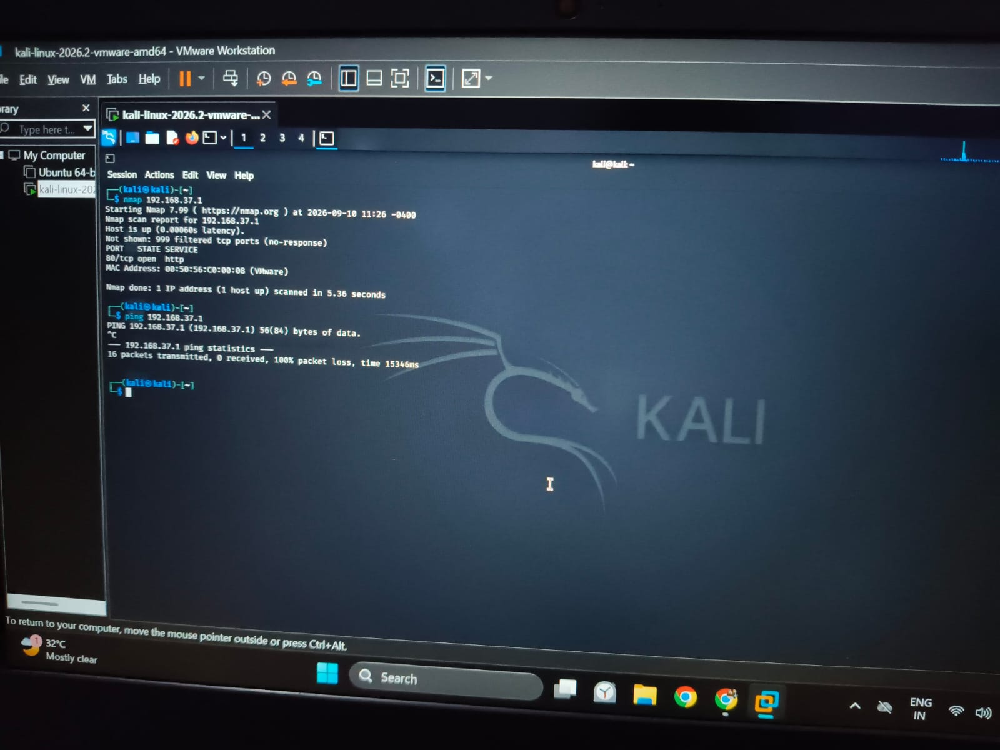
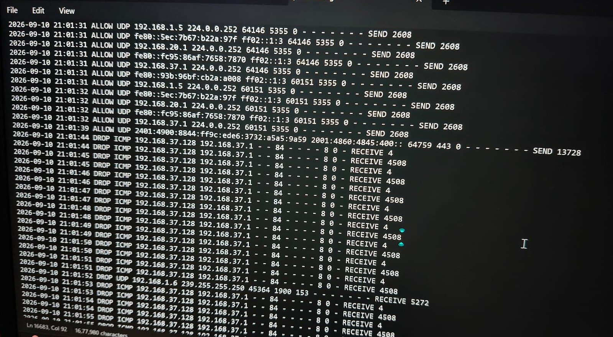

# Nmap Network Scanning Detection

## Overview

This project demonstrates the detection and analysis of network scanning activity generated using Nmap in a controlled Windows and Kali Linux lab environment.

The objective was to perform a network scan from Kali Linux against a Windows test machine and analyze the resulting Windows logs from a defensive SOC perspective.

## Lab Environment

* Attacker/Scanner: Kali Linux
* Target: Windows
* Tool: Nmap
* Log Source: Windows logs
* Environment: Controlled personal cybersecurity lab

## Project Workflow

1. Configured Kali Linux and Windows in a controlled lab environment.
2. Identified the Windows target IP address.
3. Performed an Nmap network scan from Kali Linux.
4. Observed the resulting activity on the Windows machine.
5. Examined the relevant Windows logs.
6. Identified the source IP associated with the scanning activity.
7. Analyzed the generated events and network activity.
8. Documented the findings from a SOC monitoring perspective.

## Nmap Scan

The scan was performed from Kali Linux against the Windows test machine.

The purpose of the scan was to identify reachable ports and observe how network scanning activity appears in Windows logs.

## Log Analysis

The logs were examined for relevant indicators such as:

* Source IP address
* Destination IP address
* Destination port
* Event timestamp
* Network connection/activity
* Repeated connection attempts

## Screenshots

### Nmap Scan

### Windows Logs

### Log Analysis

## SOC Relevance

Network scanning can be an early indicator of reconnaissance activity.

A SOC analyst can investigate:

* Repeated connection attempts
* Multiple destination ports
* Unusual source IP addresses
* Port scanning patterns
* Connections occurring within a short time period

These indicators can be correlated with other security logs to determine whether further investigation is required.

## Detection Improvements

Future improvements to this project include:

* Forwarding Windows logs to Splunk or Wazuh
* Creating detection rules for port-scanning patterns
* Generating SIEM alerts
* Building a monitoring dashboard
* Correlating Nmap activity with firewall and endpoint events
  
## Disclaimer

This project was performed in a controlled personal lab environment for cybersecurity learning and defensive monitoring purposes.
